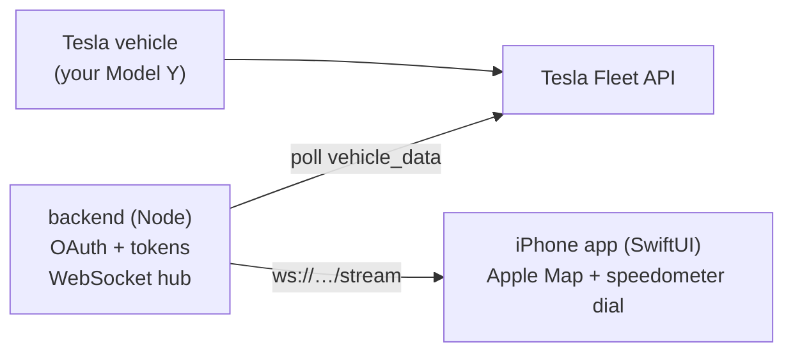

# Voltpit

A Tesla Model Y style driving dashboard for iPhone: a big speedometer over a live
Apple Map that follows your heading, fed by **your** car's data through the
**Tesla Fleet API** with realtime updates over WebSocket.



## Repo layout

| Path | What it is |
| --- | --- |
| [`backend/`](backend/) | Node + TypeScript service: Tesla OAuth, token storage, data sources (simulator + real Fleet API), and a WebSocket hub that streams `VehicleState` to the app. |
| [`ios/`](ios/) | Native SwiftUI iPhone app: Apple MapKit background, Tesla-style speedometer, heading-follow camera, realtime WebSocket client. |
| [`docs/ARCHITECTURE.md`](docs/ARCHITECTURE.md) | System overview, realtime data-flow diagram, and component responsibilities. |
| [`docs/TESLA_FLEET_API_SETUP.md`](docs/TESLA_FLEET_API_SETUP.md) | Step-by-step Tesla Fleet API onboarding (developer app, keys, OAuth, scopes). |

## Quick start (simulator mode: see the UI today)

You can run the entire thing with **fake but realistic** driving data, no Tesla
account required, then flip a switch to use your real car later.

```bash
# 1. backend
cd backend
cp .env.example .env          # SOURCE=simulator is the default
npm install
npm run dev                   # WebSocket at ws://localhost:8080/stream
```

```bash
# 2. iOS app
cd ../ios
brew install xcodegen         # one-time
xcodegen generate             # creates TeslaDash.xcodeproj from project.yml
open TeslaDash.xcodeproj
```

Set the backend URL, then run on a device or simulator. You'll see the speedometer
climb and the map follow a simulated drive. The map uses Apple **MapKit**, so no
API key or billing is required.

## Going live with your real Model Y

1. Follow [`docs/TESLA_FLEET_API_SETUP.md`](docs/TESLA_FLEET_API_SETUP.md) to register a
   developer app, host your public key, and get OAuth credentials.
2. In `backend/.env` set `SOURCE=tesla` and fill the Tesla values.
3. `npm run dev`, open `http://localhost:8080/auth/login` once to authorize your
   Tesla account, then run the app.

See [`backend/README.md`](backend/README.md) for the full backend reference.
