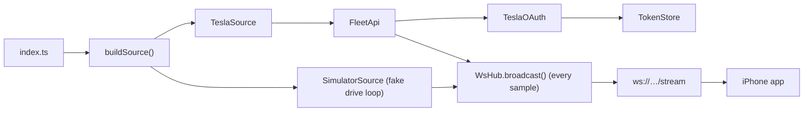

# Voltpit: Backend

Node + TypeScript service that turns your car's data into a realtime WebSocket
stream the iPhone app consumes. It abstracts the data source so you can run with
a **simulator** today and switch to the real **Tesla Fleet API** later.

## Run

```bash
cp .env.example .env      # SOURCE=simulator by default
npm install
npm run dev               # ws://localhost:8080/stream
```

`GET /health` returns `{ ok, source, clients }`.

## Configuration

All config is via `.env` (see [`.env.example`](.env.example)). Key values:

| Var | Meaning |
| --- | --- |
| `SOURCE` | `simulator` or `tesla`. |
| `PORT` | HTTP + WebSocket port (default 8080). |
| `POLL_INTERVAL_MS` | How often to poll Tesla `vehicle_data` while driving. |
| `PRIMARY_UNIT` | `mph` or `kph`: which speed the app shows large. |
| `TESLA_*` | Fleet API credentials (only for `SOURCE=tesla`). |

## The stream contract

Every update is one JSON message. The app decodes exactly this shape (kept in
sync with `VehicleState` in Swift):

```json
{
  "type": "vehicle_state",
  "ts": 1718600000000,
  "speedMph": 47.2, "speedKph": 75.9, "primaryUnit": "mph",
  "lat": 37.7749, "lng": -122.4194, "heading": 182.5,
  "shiftState": "D", "power": 23, "batteryLevel": 78,
  "source": "simulator", "online": true
}
```

Diagnostic messages use `{"type":"status","level":"info|warn|error","message":"…"}`.

## Architecture



- [`src/sources/`](src/sources/): pluggable data sources behind a common interface.
- [`src/tesla/`](src/tesla/): OAuth, the Fleet API client, and token persistence.
- [`src/routes/`](src/routes/): `/auth/*` (OAuth) and the `.well-known` public key.
- [`src/wsHub.ts`](src/wsHub.ts): fan-out to all connected apps; replays last state on connect.

## Switching to your real Tesla

1. Complete [`../docs/TESLA_FLEET_API_SETUP.md`](../docs/TESLA_FLEET_API_SETUP.md).
2. Generate the signing keys: `npm run keys` (writes `keys/`, gitignored).
3. Set `SOURCE=tesla` and the `TESLA_*` values in `.env`.
4. `npm run dev`, then open `http://localhost:8080/auth/login` once to authorize.
5. The app now shows live data whenever the car is awake.

### Realtime note

Tesla discourages aggressive polling of `vehicle_data`. This backend polls at a
configurable interval and backs off when the car is asleep. For true sub-second
updates, configure **Fleet Telemetry** (the car streams to your server); the
`TeslaSource` can then be replaced by a telemetry receiver feeding the same
`WsHub`. See the setup guide's "Upgrade to Fleet Telemetry" section.
