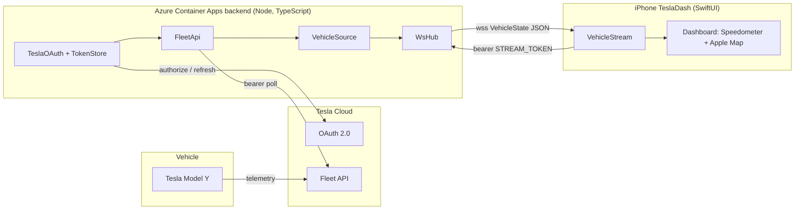
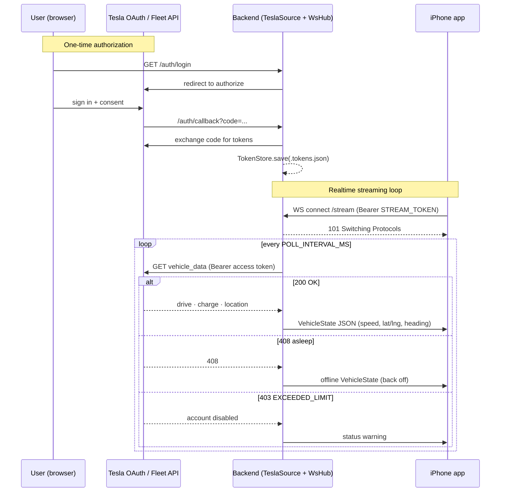

# Voltpit Architecture

Voltpit is a Tesla Model Y style driving dashboard: a large speedometer over a live
Apple Map that follows your heading, fed by your car's data through the Tesla Fleet API
with realtime updates over a WebSocket.

## System overview

## Realtime data flow

## Components

| Layer | Component | Responsibility |
| --- | --- | --- |
| Vehicle | Tesla Model Y | Reports drive, charge, and location telemetry to Tesla. |
| Tesla Cloud | OAuth 2.0 | Authorizes the app and issues access / refresh tokens. |
| Tesla Cloud | Fleet API | Serves `vehicle_data` to authenticated clients. |
| Backend | TeslaOAuth + TokenStore | Runs the OAuth code exchange and caches tokens. |
| Backend | FleetApi | Polls `vehicle_data` with a bearer token. |
| Backend | VehicleSource | Abstracts the data source (Simulator or Tesla). |
| Backend | WsHub | Broadcasts `VehicleState` to connected clients. |
| iOS | VehicleStream | WebSocket client that receives `VehicleState`. |
| iOS | Dashboard | Renders the speedometer and heading-follow Apple Map. |

See the [backend reference](../backend/README.md) and
[Tesla Fleet API setup](TESLA_FLEET_API_SETUP.md) for details.
